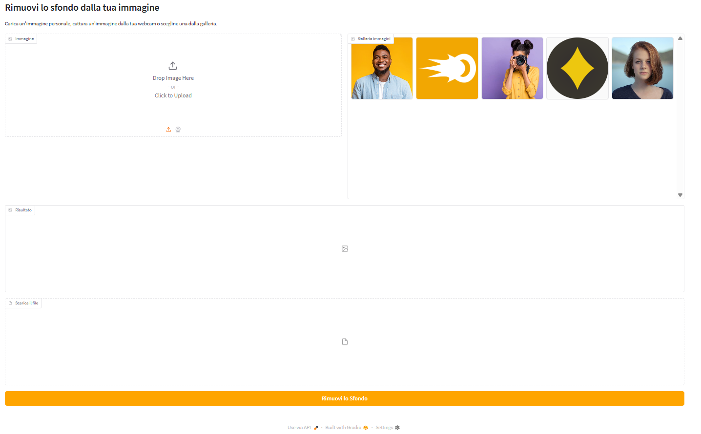

# Remove Background App



Un'applicazione interattiva realizzata con Gradio per rimuovere lo sfondo dalle immagini, pronta per essere hostata su Hugging Face.

## 🌐 Demo online

Prova il progetto online su Hugging Face:

🔗 Rimozione Sfondo – Hugging Face Space: https://huggingface.co/spaces/Danzer93/RemoveBackground

## ✨ Funzionalità

- ✅ Carica un'immagine dal tuo dispositivo o scatta una foto con la webcam
- ✅ Seleziona un'immagine pre-caricata dalla galleria
- ✅ Visualizza l'immagine con lo sfondo rimosso
- ✅ Scarica l'immagine risultante in formato .png con sfondo trasparente
- ✅ CSS personalizzati e interfacce localizzate in italiano

## 🛠️ Tecnologie utilizzate

- Gradio — per creare l'interfaccia utente web
- Rembg — per rimuovere lo sfondo dalle immagini
- Pillow (PIL) — per la manipolazione delle immagini
- Python 3.10+

## 🧪 Esegui in locale

### 1. Clona la repository

```bash
git clone https://github.com/Danzer-bit/RimuoviSfondoApp.git
cd rimozione-sfondo
 ```

### 2. Installa le dipendenze

Ti consigliamo di usare un ambiente virtuale:
```bash
python -m venv venv
source venv/bin/activate  # su Linux/Mac
venv\Scripts\activate     # su Windows

pip install -r requirements.txt
 ```

### 3. Avvia l'app
```bash
python app.py
```
Apri il browser su http://localhost:7860

## 🚀 Host su Hugging Face Spaces

1. Crea uno Space su Hugging Face Spaces (https://huggingface.co/spaces)
2. Scegli il tipo Gradio
3. Carica tutti i file della repo (inclusi app.py, gallery/, outputs/, ecc.)


5. Lo Space si avvierà automaticamente (ci vorrà qualche minuto)

## 📁 Struttura della cartella

```text
├── gallery/             # immagini mostrate nella galleria, modificabili a piacere
├── outputs/             # immagini elaborate generate
├── .gitattributes       # configurazione EOL e linguist (opzionale)
├── app.py               # codice principale dell'app
├── requirements.txt     # dipendenze Python
└── README.md            # questo file, da sostituire con file per Hugging Face
```

Non hai bisogno della cartella img di questa repo, usata solo per la preview di questa guida


## 📄 Licenza

Distribuito sotto licenza MIT. Vedi LICENSE per maggiori dettagli.
